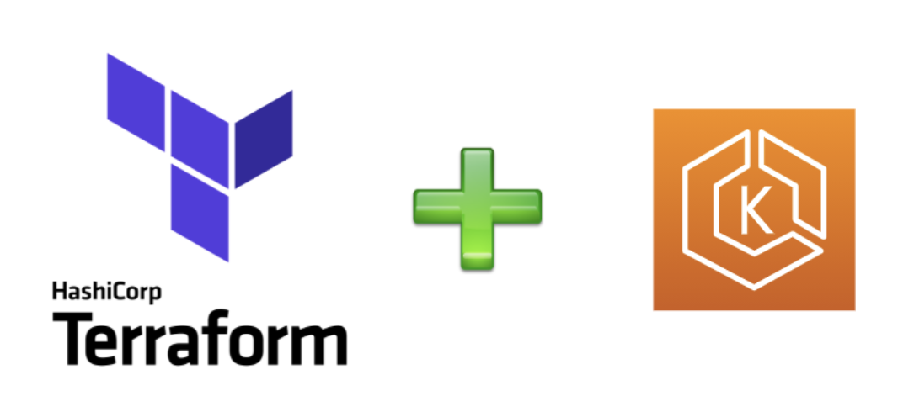

# my-eks-tf

This repository provides ideas on how one could structure various terraform modules and build scaffolding for their end user. The example in this repository creates an eks cluster within it's own vpc with public and private subnets.



## Summary

This repository has a top level terraform module [cluster](./cluster/README.md) which scaffolds [vpc_and_subnets](./modules/vpc_and_subnets/README.md) and [eks](./modules/eks/README.md) modules to create following resources -
- VPC
- Subnets (3 public and 3 private)
- 1 NAT Gateway per AZ with corresponding Elastic IPs
- Internet Gateway
- Public and Private Route tables
- EKS Cluster with OIDC Provider
- [EKS Managed AddOns](https://docs.aws.amazon.com/eks/latest/userguide/eks-add-ons.html)
  - coredns
  - vpc-cni
  - kube-proxy
- EKS Managed node group

## Links to module documentation

| Module Name | Documentation Link |
|-------------|--------------------|
| Cluster module with EKS, VPC and Subnets | [README](./cluster/README.md)
| EKS | [README](./modules/eks/README.md) |
| VPC And Subnets | [README](./modules/vpc_and_subnets/README.md) |

## Modularization of terraform

`cluster` is the top level module which is scaffold over `vpc_and_subnets` and `eks` modules. 

Essentially you can imagine that your infrastructure team is building APIs by building opinionated `vpc_and_subnets` and `eks` modules in different repository. And your team's Platform team building `cluster` module which makes use of these APIs. And top level `main.tf` file invoking `cluster` module, this can be written by your developer team member who wants to use the EKS Cluster. 

As you can see in the [cluster module's main.tf](./cluster/main.tf) we are invoking `vpc_and_subnets` and `eks` modules, and you can specify the `source` to remote github repository where your source of the modules are, you can read about [module sources](https://developer.hashicorp.com/terraform/language/modules/sources) in the official terraform documentation.

Hope by looking at the module structure you will find some ideas to modularize and structure your terraform.

## Prerequisites for this repository

- Basic understanding of AWS, [EKS](https://docs.aws.amazon.com/eks/latest/userguide/what-is-eks.html), [VPC](https://docs.aws.amazon.com/vpc/latest/userguide/what-is-amazon-vpc.html), and [Terraform](https://developer.hashicorp.com/terraform).

- [AWS account](https://aws.amazon.com/free) with necessary permissions to create VPC, Subnets, EKS Cluster etc..
  
- Configure [aws cli](https://docs.aws.amazon.com/cli/latest/userguide/getting-started-install.html) to point to your aws account, you will need this to generate the kubeconfig to connect to the cluster.
  
- Install [kubectl](https://docs.aws.amazon.com/eks/latest/userguide/install-kubectl.html) compatible with the EKS version you are installing.
  
- Try to work with [Latest version of Terraform](https://developer.hashicorp.com/terraform/downloads). I have used `v1.5.2` on mac for this blog. If you want to manage multiple versions of Terraform use [tfswitch](https://tfswitch.warrensbox.com/Install/), I love it.
  
- If you want to learn how to generate the documentation from terraform files, install [terraform-docs](https://terraform-docs.io/user-guide/installation/)

- Install [helm](https://v3.helm.sh/docs/intro/install/) a package manager for Kubernetes manifests, we will use it to install [nginx helm chart](https://docs.nginx.com/nginx-ingress-controller/installation/installation-with-helm/#installing-the-chart) once the cluster is created.

## Prepare .tfvars file

`.tfvars` is a way to create the input files for terraform module. For example, you can create  `dev.tfvars` for `dev` environment, `test.tfvars` for `test` environment and so on. 

We have a [sample.tfvars](./sample.tfvars) for reference, substitute values as per your need and play around.

## Execute terraform to create the infrastructure

This section explains how to execute the terraform module [cluster](./cluster/README.md) to create vpc, subnets and eks cluster.

### main.tf

In [main.tf](./main.tf) tf file you will see that we are setting up the `aws` provider and calling [cluster](./cluster/README.md) module. You will see that we are passing all the variables required by `cluster` modules.

### variables.tf

In [variables.tf](./variables.tf) tf file you will see declaration of all the variables we are taking input from `.tfvars` file and passing it to `cluster` module.

### outputs.tf

In [outputs.tf](./outputs.tf) tf file you will see declaration of any output variables we might need for our usage after the resources are created. These values are being copied from [cluster](./cluster/outputs.tf) module's output, which accumulates from [eks](./modules/eks/outputs.tf) and [vpc_and_subnets](./modules/vpc_and_subnets/outputs.tf) module outputs.

### How to execute

Execute all the commands below from `my-eks-tf` root where the above explained files are -

1. Make sure your terminal is configured to talk to AWS Account, you can use one of the ways explained in this [document](https://docs.aws.amazon.com/cli/latest/userguide/cli-chap-configure.html). In my case I am using one of the profiles present in my `~/.aws/config` file and setting the environment variable as below -

```shell
export AWS_PROFILE="my-aws-profile"
```

**Another** simple way is create an IAM User with `AdminstratorAccess` (only do for temporary purpose to quickly test, and make sure to delete the IAM User after usage) and set the following environment variables on the terminal.

```shell
export AWS_ACCESS_KEY_ID=<access key id copied after creating the IAM User>
export AWS_SECRET_ACCESS_KEY=<secret access key copied after creating the IAM User>
```

NOTE: if you choose the `assumeRole` option, you will need to modify the `provider` block in main.tf, I have kept a sample commented code. Please refer terraform documentation for more ways to set the [provider](https://registry.terraform.io/providers/hashicorp/aws/latest/docs#authentication-and-configuration).

2. Make sure the s3 bucket to store the tfstate file exists, if not please create. Following is an example how you can use aws cli to create the s3 bucket.

```shell
aws s3api create-bucket --bucket "your-bucket-name" --region "your-aws-region"
```

3. Initialize the module and set the backend of `tfstate` file which records the state of the resources created by `terraform apply` invocation.
   
```shell
# tfstate file name
tfstate_file_name="<some name e.g. eks-1111111111>"

# tfstate s3 bucket name, this will have the tfstate file which you can use for further runs of this terraform module
# for example to upgrade k8s version or add new node pools etc.. The bucket name must be unique as s3 is a global service. Terraform will create the s3 bucket if it doesn't exist
tfstate_bucket_name="unique s3 bucket name you created above e.g. my-tfstate-<myname>"

# initialize the terraform module
terraform init -backend-config "key=${tfstate_file_name}" -backend-config "bucket=${tfstate_bucket_name}" -backend-config "region=us-east-1"
```

After execution of above, you will observe that, an s3 bucket is created in aws account.

4. Retrieve the `terraform plan`, a preview of what will happen when you apply this terraform module. This is a best practice to understand the change.

```shell
terraform plan -var-file="path/to/your/terraform.tfvars"

# example
terraform plan -var-file="sample.tfvars"
```

5. If you are satisfied with the plan above, this is the final step to apply the terraform and wait for the resources to be created. It will take about ~20 mins for all the resources to be created.

```shell
terraform apply -var-file="path/to/your/terraform.tfvars"

# example
terraform apply -var-file="sample.tfvars"
```

After successful execution, go to next section on how to connect to the EKS Cluster and install `nginx` helm chart.

## Connect to eks cluster and install nginx helm chart

In this section we will show how to connect to eks cluster and install `nginx` helm chart. This is just to prove that you have successfully created a function eks cluster. This is with the assumption that you have installed all the cli tools mentioned in the pre-requisites section above.

1. Retrieve kubeconfig using aws cli, assuming you have configured the aws cli properly to point to the aws account which has the eks cluster. Please see [aws cli documentation](https://docs.aws.amazon.com/cli/latest/userguide/cli-chap-configure.html) for configuration details.

```shell
aws eks update-kubeconfig --region "<aws region where we created the eks cluster>" --name "<eks cluster name>"

# as per the sample.tfvars parameters
aws eks update-kubeconfig --region "us-east-2" --name "platformwale"
```

2. You can check if you are pointing to the right kubernetes cluster by running following kubectl command
   
```shell
kubectl config current-context
```

3. Install nginx helm chart

```shell
helm repo add bitnami https://charts.bitnami.com/bitnami
helm install -n default nginx bitnami/nginx
```

4. Check if all the pods are scheduled and running. Also validate that the load balancer is created, you can copy paste the `EXTERNAL-IP` and put it in browser, you should see the `Welcome to nginx!` page as shown in the screenshot below.

```shell
kubectl get pods -n default
kubectl get svc -n default
```
```
# example
$ kubectl get pods -n default
NAME                     READY   STATUS    RESTARTS   AGE
nginx-7c8ff57685-ck9pn   1/1     Running   0          3m31s

$ kubectl get svc -n default nginx
NAME    TYPE           CLUSTER-IP       EXTERNAL-IP                                                              PORT(S)        AGE
nginx   LoadBalancer   172.20.214.161   a90947031083b48b9b61849f22cdceda-410225407.us-east-2.elb.amazonaws.com   80:32414/TCP   2m59s
```


## Cleanup

This is the most important step if you don't want any unexpected cloud costs on your account.

1. Make sure to uninstall the `nginx` helm chart to delete the loadbalancer before you start destroying the infrastructure in next step using `terraform destroy`. Make sure the `nginx` svc is deleted.

```shell
helm uninstall -n default nginx
```
```
# validate that the external service is deleted, it takes a few mins
$ kubectl get svc -n default nginx
Error from server (NotFound): services "nginx" not found
```

2. Destroy the infrastructure. It takes about ~15 mins to delete the infrastructure we created above.

```shell
terraform destroy -var-file="sample.tfvars"
```

3. Delete the s3 bucket created to store tfstate

```shell

# empty the bucket
aws s3 rm s3://<your-bucket-name> --recursive

# delete the bucket
aws s3api delete-bucket --bucket "your-bucket-name" --region "your-aws-region"

```

## Terraform Documentation

### Requirements

| Name | Version |
|------|---------|
| <a name="requirement_aws"></a> [aws](#requirement\_aws) | 5.6.2 |

### Providers

| Name | Version |
|------|---------|
| <a name="provider_aws"></a> [aws](#provider\_aws) | 5.6.2 |

### Modules

| Name | Source | Version |
|------|--------|---------|
| <a name="module_cluster"></a> [cluster](#module\_cluster) | [./cluster](./cluster) | n/a |

### Inputs

| Name | Description | Type | Default | Required |
|------|-------------|------|---------|:--------:|
| <a name="input_cluster_name"></a> [cluster\_name](#input\_cluster\_name) | eks cluster name | `string` | `"platformwale"` | no |
| <a name="input_k8s_version"></a> [k8s\_version](#input\_k8s\_version) | k8s version | `string` | `"1.27"` | no |
| <a name="input_region"></a> [region](#input\_region) | aws region where the resources are being created | `string` | n/a | yes |
| <a name="input_vpc_cidr"></a> [vpc\_cidr](#input\_vpc\_cidr) | vpc cidr block to be used | `string` | `"10.0.0.0/16"` | no |
| <a name="input_vpc_name"></a> [vpc\_name](#input\_vpc\_name) | name of the vpc to be created | `string` | `"platformwale"` | no |

### Outputs

| Name | Description |
|------|-------------|
| <a name="output_cluster_certificate_authority_data"></a> [cluster\_certificate\_authority\_data](#output\_cluster\_certificate\_authority\_data) | Base64 encoded certificate data required to communicate with the cluster |
| <a name="output_cluster_endpoint"></a> [cluster\_endpoint](#output\_cluster\_endpoint) | Endpoint for your Kubernetes API server |
| <a name="output_cluster_oidc_issuer_url"></a> [cluster\_oidc\_issuer\_url](#output\_cluster\_oidc\_issuer\_url) | The URL on the EKS cluster for the OpenID Connect identity provider |

## Handy commands

1. Generate documentation by running `terraform-docs` command from the module directory. Now you can copy the documentation from stdout.

```shell
cd ./modules/eks
terraform-docs markdown .
```

2. Format `hcl` files.

```shell
# recursively format all the files
terraform fmt -recursive

# just want to format a file
terraform fmt "<file/path>"
```

## Troubleshooting

1. If you see following error while executing `terraform init` command for the first time, this means the tfstate s3 bucket is not created, manually create the s3 bucket. You can read more details as mentioned in [terraform s3 backend documentation](https://developer.hashicorp.com/terraform/language/settings/backends/s3).

```
╷
│ Error: Failed to get existing workspaces: S3 bucket does not exist.
│
│ The referenced S3 bucket must have been previously created. If the S3 bucket
│ was created within the last minute, please wait for a minute or two and try
│ again.
│
│ Error: NoSuchBucket: The specified bucket does not exist
│ 	status code: 404, request id: 2R4WDEWZZQGXT7YD, host id: YHsfJYMpCvY5XcP+3rPzhpKl0kpmIku/VvSCjXfxHgskkTec7e0IPlm5PAjjCb3yUaKnlJ5HTMq3HgByAepruXbT2MyQEf/J
│
│
│
```

You can also use the below AWS Cli command to create the aws s3 bucket, make sure your aws cli is configured to point to the aws account where you want to run the terraform.

```shell
aws s3api create-bucket --bucket "your-bucket-name" --region "your-aws-region"
```
